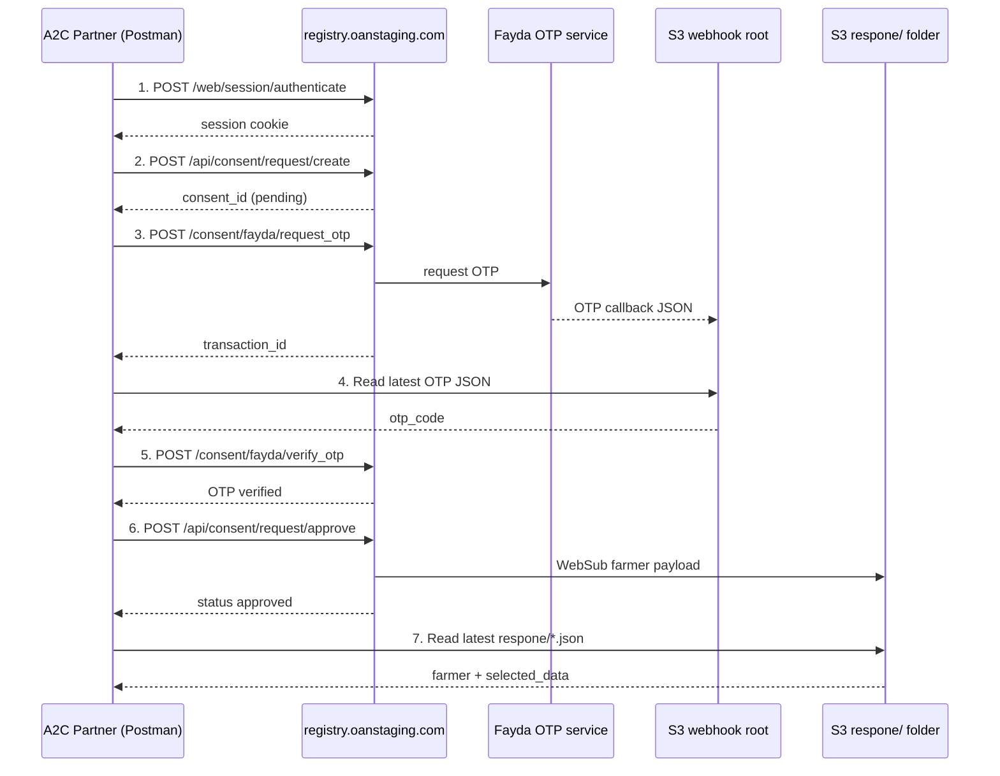

# Consent Management API — Registry A2C

Documentation for the **Consent Management** Postman collection used in the A2C (Access to Credit) loan flow against the OpenG2P/Odoo registry.

| Item | Value |
|------|-------|
| Registry base URL | [http://registry.oanstaging.com](http://registry.oanstaging.com) |
| Odoo database | `management` |
| Postman collection | `Consent Management.postman_collection.json` |
| OTP webhook bucket | [http://a2c-webhook.s3-website.ap-south-1.amazonaws.com/](http://a2c-webhook.s3-website.ap-south-1.amazonaws.com/) |
| Farmer data webhook folder | [http://a2c-webhook.s3-website.ap-south-1.amazonaws.com/respone/](http://a2c-webhook.s3-website.ap-south-1.amazonaws.com/respone/) |

---

## Purpose

These APIs let an A2C partner:

1. Authenticate to the registry
2. Create a consent request for a farmer
3. Request and verify a Fayda OTP
4. Approve the consent
5. Receive the farmer’s shared data via a WebSub webhook payload stored in the public S3 bucket

---

## End-to-end flow



### Recommended request order (Postman)

| Step | Request | Notes |
|------|---------|-------|
| 1 | `1. login` | Saves session cookie automatically |
| 2 | `2. create consent` | Sets `consent_id` collection variable |
| 3 | `3. request otp` | Sets `transaction_id` collection variable |
| 4 | `A. list OTP webhooks (S3)` | Finds newest root JSON file |
| 5 | `B. fetch latest OTP webhook` | Sets `otp_code` from webhook JSON |
| 6 | `4. verify otp` | Uses `transaction_id` + `otp_code` |
| 7 | `5. approve` | Publishes farmer data webhook |
| 8 | `C. list farmer webhooks (S3)` | Finds newest file under `respone/` |
| 9 | `D. fetch latest farmer webhook` | Returns farmer details payload |

---

## Authentication

All registry endpoints except login require an authenticated Odoo session cookie.

### Login

**POST** `/web/session/authenticate`

```json
{
  "jsonrpc": "2.0",
  "method": "call",
  "params": {
    "db": "management",
    "login": "messi@gmail.com",
    "password": "messi@gmail.com"
  }
}
```

**Success response (abbreviated):**

```json
{
  "jsonrpc": "2.0",
  "id": null,
  "result": {
    "uid": 2,
    "username": "messi@gmail.com",
    "name": "messi",
    "session_id": "..."
  }
}
```

Postman stores the session cookie when **Send cookies** is enabled (default). Run login before any other registry request.

---

## Registry API endpoints

All registry calls use:

- **Method:** `POST`
- **Header:** `Content-Type: application/json`
- **Body format:** JSON-RPC 2.0 with Odoo `type="json"` routes (`method: "call"`, parameters in `params`)

Successful business responses are wrapped as:

```json
{
  "jsonrpc": "2.0",
  "id": null,
  "result": {
    "success": true,
    "message": "OK",
    "data": { }
  }
}
```

Errors:

```json
{
  "result": {
    "success": false,
    "code": 400,
    "message": "Human-readable error"
  }
}
```

### Create consent

**POST** `/api/consent/request/create`

| Parameter | Required | Description |
|-----------|----------|-------------|
| `partner_id` | Yes | Consent parent partner record ID (e.g. `7` for user `messi`) |
| `farmer_db_id` | Yes* | Registry `res.partner` ID of the approved farmer |
| `consent_type` | No | Default `specific` |
| `purpose` | No | Free-text purpose |
| `validity_from` / `validity_to` | No | Datetime strings `YYYY-MM-DD HH:MM:SS` |
| `allowed_data_field_ids` | Yes | Array of data-field IDs allowed for this partner |
| `originated_from` | No | e.g. `partner` |

\*Alternatively: `farmer_id` or `national_id`.

**Example:**

```json
{
  "jsonrpc": "2.0",
  "method": "call",
  "params": {
    "partner_id": 7,
    "farmer_db_id": 10,
    "consent_type": "specific",
    "purpose": "A2C data sharing for agricultural services",
    "validity_from": "2026-05-29 00:00:00",
    "validity_to": "2027-05-29 00:00:00",
    "allowed_data_field_ids": [3],
    "originated_from": "partner"
  }
}
```

**Success `data`:**

```json
{
  "id": 4,
  "consent_creation_request_id": "37caed75-c7b4-420f-8bca-6a6c05cb33c7",
  "status": "pending"
}
```

### Request OTP

**POST** `/consent/fayda/request_otp`

```json
{
  "jsonrpc": "2.0",
  "method": "call",
  "params": {
    "farmer_id": 10
  }
}
```

**Success `data`:**

```json
{
  "transaction_id": "559329D7429F4B14A1569AF9CA5D57B0",
  "masked_mobile": "09xxxxxx55",
  "masked_email": "",
  "identifier_type": "Fayda ID",
  "identifier_source": "reg_id"
}
```

The OTP itself is **not** returned in this response. It is written to the webhook bucket configured for the Fayda/staging integration.

### Verify OTP

**POST** `/consent/fayda/verify_otp`

```json
{
  "jsonrpc": "2.0",
  "method": "call",
  "params": {
    "farmer_id": 10,
    "transaction_id": "559329D7429F4B14A1569AF9CA5D57B0",
    "otp_code": "050389"
  }
}
```

OTP codes expire quickly. Always use the value from the latest webhook file.

### Approve consent

**POST** `/api/consent/request/approve`

```json
{
  "jsonrpc": "2.0",
  "method": "call",
  "params": {
    "consent_id": 4
  }
}
```

Alternatively use `consent_creation_request_id` instead of `consent_id`.

**Prerequisites for approval:**

- Partner must have an active **External** WebSub configuration with event `WEBSUB_INDIVIDUAL_UPDATED`
- WebSub hub must deliver to the S3 `respone/` webhook URL
- `allowed_data_field_ids` must resolve to publishable farmer data

On approval the registry enqueues a WebSub publish job. The farmer payload appears in the response webhook folder shortly after.

---

## Webhook bucket

The staging environment uses a public S3 website bucket as a webhook sink for testing.

| Location | URL | Purpose |
|----------|-----|---------|
| Bucket root | [http://a2c-webhook.s3-website.ap-south-1.amazonaws.com/](http://a2c-webhook.s3-website.ap-south-1.amazonaws.com/) | OTP callback JSON files |
| Response folder | [http://a2c-webhook.s3-website.ap-south-1.amazonaws.com/respone/](http://a2c-webhook.s3-website.ap-south-1.amazonaws.com/respone/) | Farmer data after consent approval |

### Retrieving OTP

**Option A — Browser**

Open the [bucket browser](http://a2c-webhook.s3-website.ap-south-1.amazonaws.com/), open the newest JSON file at the root (not under `respone/`), and copy the OTP value into the Postman `otp_code` variable.

**Option B — S3 list API (used by Postman helpers)**

```bash
curl -s "https://a2c-webhook.s3.ap-south-1.amazonaws.com/?list-type=2&max-keys=20"
```

Fetch the newest root JSON:

```bash
curl -s "http://a2c-webhook.s3-website.ap-south-1.amazonaws.com/<filename>.json"
```

The OTP webhook schema may vary by environment. Common fields the collection test script checks:

- `otp` / `otp_code`
- `transaction_id` / `transactionID`

### Retrieving farmer data after approval

List files under `respone/`:

```bash
curl -s "https://a2c-webhook.s3.ap-south-1.amazonaws.com/?list-type=2&prefix=respone/&max-keys=20"
```

Fetch the newest payload:

```bash
curl -s "http://a2c-webhook.s3-website.ap-south-1.amazonaws.com/respone/2026-05-29T14-08-45_777ce00c.json"
```

---

## Sample farmer webhook payload

After approval, a file similar to this appears under `respone/`:

```json
{
  "source": "g2p_ati_consent_mgt",
  "event_type": "WEBSUB_INDIVIDUAL_UPDATED",
  "published_at": "2026-05-29 08:38:15",
  "consent": {
    "id": 4,
    "consent_creation_request_id": "37caed75-c7b4-420f-8bca-6a6c05cb33c7",
    "consent_type": "specific",
    "status": "approved",
    "approved_at": "2026-05-29 08:38:15",
    "validity_from": "2026-05-29 08:38:15",
    "validity_to": "2027-05-24 08:38:15",
    "requested_field_codes": ["test"],
    "published_field_codes": ["test"],
    "data_field_mode": "dynamic"
  },
  "consent_partner": {
    "id": 7,
    "name": "messi",
    "ref": false,
    "websub_config_id": 1,
    "websub_config_name": "abcd"
  },
  "farmer": {
    "id": 10,
    "farmer_id": false,
    "name": "ELDHO ELDHO ELDHO"
  },
  "selected_data": {
    "demo payload": {
      "first name": false,
      "given name": false,
      "father name": false,
      "email": false
    }
  }
}
```

| Field | Meaning |
|-------|---------|
| `consent` | Approved consent metadata |
| `consent_partner` | Partner that requested data |
| `farmer` | Farmer registry record |
| `selected_data` | Published field values per WebSub configuration |

---

## Collection variables

| Variable | Default | Description |
|----------|---------|-------------|
| `url` | `http://registry.oanstaging.com` | Registry base URL |
| `db` | `management` | Odoo database |
| `login` / `password` | `messi@gmail.com` | Test partner credentials |
| `partner_id` | `7` | Consent parent partner for `messi` |
| `farmer_db_id` | `10` | Test farmer |
| `allowed_data_field_ids` | `[3]` | Must match partner-allowed fields |
| `transaction_id` | *(auto)* | From request OTP |
| `otp_code` | *(auto)* | From OTP webhook |
| `consent_id` | *(auto)* | From create consent |
| `webhook_url` | S3 website root | OTP bucket browser/API |
| `webhook_response_url` | S3 `respone/` path | Farmer payload folder |

---

## Terminal test script

A shell script is available at `test_consent_management_apis.sh`:

```bash
chmod +x ~/Downloads/test_consent_management_apis.sh
BASE_URL=http://registry.oanstaging.com ~/Downloads/test_consent_management_apis.sh
```

The script runs login → create → request OTP → verify → approve. For OTP it attempts S3 listing; set `OTP_CODE` manually if auto-detection fails:

```bash
OTP_CODE=123456 BASE_URL=http://registry.oanstaging.com ~/Downloads/test_consent_management_apis.sh
```

---

## Troubleshooting

| Symptom | Likely cause |
|---------|--------------|
| `Access denied` on OTP endpoints | User is not linked to a consent parent partner |
| `No valid allowed_data_field_ids` | Field IDs not configured on the partner |
| `WebSub configuration is not selected` on approve | Partner missing active External WebSub config |
| OTP verify fails | Expired OTP or wrong `transaction_id` |
| No file in `respone/` | Approval failed, WebSub not configured, or job still queued |
| Empty `selected_data` in webhook | WebSub config has no publishable fields for this farmer |

---

## Related resources

- Registry login UI: [http://registry.oanstaging.com](http://registry.oanstaging.com)
- OTP webhook browser: [http://a2c-webhook.s3-website.ap-south-1.amazonaws.com/](http://a2c-webhook.s3-website.ap-south-1.amazonaws.com/)
- Farmer webhook browser: [http://a2c-webhook.s3-website.ap-south-1.amazonaws.com/respone/](http://a2c-webhook.s3-website.ap-south-1.amazonaws.com/respone/)
