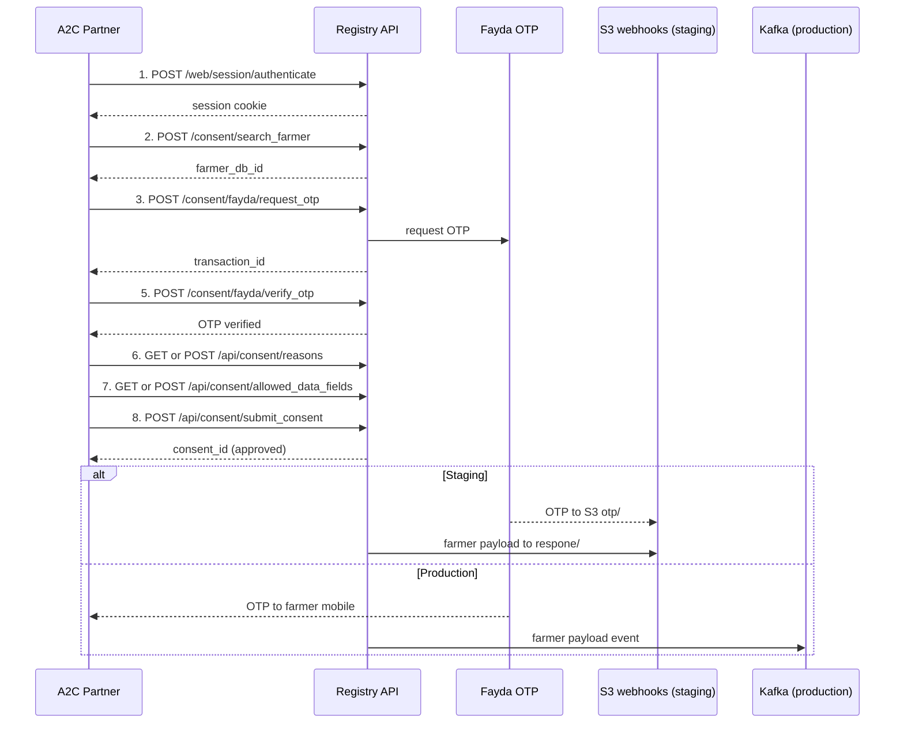

# Consent Management API — Registry A2C

API reference for the **Consent Management** Postman collection used in the A2C (Access to Credit) loan flow.

| Item | Value |
|------|-------|
| Postman collection | `Consent Management.postman_collection.json` (production defaults) |
| Production registry | [https://farmer-profile.ati.gov.et](https://farmer-profile.ati.gov.et) |
| Staging registry | [https://registry.oanstaging.com](https://registry.oanstaging.com) |
| Workflow guide (production UI) | [`consent_management_postman_registry_a2c_workflow.md`](consent_management_postman_registry_a2c_workflow.md) |

---

## Purpose

These APIs let an A2C partner:

1. Authenticate to the registry
2. Search for a farmer by registration ID
3. Request and verify a Fayda OTP
4. Fetch consent reasons and allowed data fields
5. Submit a consent request (inline PDF) — auto-created and auto-approved
6. Receive shared farmer data (S3 webhooks on staging, Kafka on production)

---

## Environments

### Staging

For integration testing with mock webhook delivery via S3.

| Item | Value |
|------|-------|
| Registry | `https://registry.oanstaging.com` |
| Database | `odoo` |
| Credentials | `a2capp@test.com` / `a2capp@test.com` |
| Search parameter | `query` or `farmer_id` |
| Verify OTP field | `otp_code` |
| Fetch reasons / allowed fields | `POST` |
| OTP source | [S3 otp/ folder](http://a2c-webhook.s3-website.ap-south-1.amazonaws.com/otp/) |
| Farmer data sink | [S3 respone/ folder](http://a2c-webhook.s3-website.ap-south-1.amazonaws.com/respone/) |

### Production (ATI Farmer)

The Postman collection defaults to this environment.

| Item | Value |
|------|-------|
| Registry | `https://farmer-profile.ati.gov.et` |
| Database | `socialregistrydb` |
| Credentials | Contact the administrator |
| Search parameter | `farmer_id` |
| Verify OTP field | `otp` |
| Fetch reasons / allowed fields | `GET` |
| OTP source | Farmer's mobile (Fayda) |
| Farmer data sink | Kafka (partner must subscribe) |

### Environment differences at a glance

| Setting | Staging | Production |
|---------|---------|------------|
| `base_url` | `https://registry.oanstaging.com` | `https://farmer-profile.ati.gov.et` |
| `db` | `odoo` | `socialregistrydb` |
| Search body key | `query` (staging script) / `farmer_id` | `farmer_id` |
| Verify OTP key | `otp_code` | `otp` |
| Reasons endpoint method | `POST` | `GET` |
| Allowed fields method | `POST` | `GET` |
| JSON body | includes `method: "call"` (staging) | `jsonrpc` + `params` only |

---

## End-to-end flow



### Recommended request order (Postman)

| Step | Request | Notes |
|------|---------|-------|
| 1 | `1. login` | Saves session cookie and `partner_id` |
| 2 | `2. search farmer` | Sets `farmer_db_id` |
| 3 | `3. request otp` | Sets `transaction_id` |
| 4a | `A–B. OTP webhook helpers` | **Staging only** — fetch OTP from S3 |
| 4b | Enter OTP manually | **Production** — from farmer's mobile |
| 5 | `4. verify otp` | Uses `transaction_id` + OTP |
| 6 | `5. Fetch Consent Reasons` | Sets `consent_reason_id` |
| 7 | `6. Fetch Allowed Data Fields` | Sets `allowed_data_field_ids` |
| 8 | `7. Submit Consent` | Auto-creates and auto-approves |
| 9 | `C–D. Farmer webhook helpers` | **Staging only** — read `respone/` payload |

---

## Authentication

**POST** `/web/session/authenticate`

Production example (matches collection):

```json
{
  "jsonrpc": "2.0",
  "params": {
    "db": "socialregistrydb",
    "login": "test@user.com",
    "password": "pass"
  }
}
```

Staging example:

```json
{
  "jsonrpc": "2.0",
  "method": "call",
  "params": {
    "db": "odoo",
    "login": "a2capp@test.com",
    "password": "a2capp@test.com"
  }
}
```

All other endpoints require the session cookie from this response.

---

## Registry API endpoints

Requests use JSON-RPC 2.0 (`jsonrpc`, `params`). Staging may also include `"method": "call"`.

Successful responses:

```json
{
  "jsonrpc": "2.0",
  "id": null,
  "result": {
    "success": true,
    "message": "OK",
    "data": {}
  }
}
```

### Search farmer

**POST** `/consent/search_farmer`

| Parameter | Required | Description |
|-----------|----------|-------------|
| `farmer_id` | Yes (production) | Farmer registration / Fayda UID |
| `query` | Yes (staging script) | Legacy staging search string |

Production / collection example:

```json
{
  "jsonrpc": "2.0",
  "params": {
    "farmer_id": "1234567"
  }
}
```

Use the returned `farmers[0].id` as `farmer_db_id`.

### Request OTP

**POST** `/consent/fayda/request_otp`

```json
{
  "jsonrpc": "2.0",
  "params": {
    "farmer_id": 30
  }
}
```

Returns `transaction_id`. The OTP itself is not in the response — obtain it from S3 (staging) or the farmer's phone (production).

### Verify OTP

**POST** `/consent/fayda/verify_otp`

Production (collection uses `otp`):

```json
{
  "jsonrpc": "2.0",
  "params": {
    "transaction_id": "4886E1A5AD5042FDB49DFFC2EE502E5F",
    "otp": "965332",
    "farmer_id": 30
  }
}
```

Staging (uses `otp_code`):

```json
{
  "jsonrpc": "2.0",
  "method": "call",
  "params": {
    "farmer_id": 30,
    "transaction_id": "4886E1A5AD5042FDB49DFFC2EE502E5F",
    "otp_code": "965332"
  }
}
```

> The Postman collection variable is named `otp_code` in both environments; production maps it to the `otp` request field.

### Fetch consent reasons

**Production:** `GET` `/api/consent/reasons`

```json
{
  "jsonrpc": "2.0",
  "params": {}
}
```

**Staging:** `POST` `/api/consent/reasons` with `"method": "call"` and empty `params`.

### Fetch allowed data fields

**Production:** `GET` `/api/consent/allowed_data_fields`

```json
{
  "jsonrpc": "2.0",
  "params": {}
}
```

**Staging:** `POST` `/api/consent/allowed_data_fields` — may include `partner_id` in `params`.

### Submit consent

**POST** `/api/consent/submit_consent`

Submits consent with inline PDF attachment. Auto-creates and auto-approves — no separate create/approve step.

| Parameter | Required | Description |
|-----------|----------|-------------|
| `farmer_id` | Yes | Registry `res.partner` ID |
| `consent_type` | No | Default `specific` |
| `consent_reason_id` | Yes | From fetch consent reasons |
| `validity_months` | No | Default `12` |
| `allowed_data_field_ids` | Yes | Array of field IDs |
| `attachment_base64` | Yes | Base64-encoded PDF |
| `attachment_filename` | Yes | PDF filename |
| `fayda_otp_transaction_id` | Yes | Verified OTP `transaction_id` |

```json
{
  "jsonrpc": "2.0",
  "params": {
    "farmer_id": 30,
    "consent_type": "specific",
    "consent_reason_id": 1,
    "validity_months": 12,
    "allowed_data_field_ids": [1],
    "attachment_base64": "<base64-encoded-pdf>",
    "attachment_filename": "consent_form_test.pdf",
    "fayda_otp_transaction_id": "4886E1A5AD5042FDB49DFFC2EE502E5F"
  }
}
```

**Success `data`:**

```json
{
  "consent_id": 96,
  "status": "approved",
  "auto_approved": true,
  "auto_approval_failed": false,
  "auto_approve_method": "otp",
  "error_details": null
}
```

---

## Staging webhook bucket

Used only for staging integration testing.

| Location | URL | Purpose |
|----------|-----|---------|
| OTP folder | [http://a2c-webhook.s3-website.ap-south-1.amazonaws.com/otp/](http://a2c-webhook.s3-website.ap-south-1.amazonaws.com/otp/) | Fayda OTP callback JSON |
| Response folder | [http://a2c-webhook.s3-website.ap-south-1.amazonaws.com/respone/](http://a2c-webhook.s3-website.ap-south-1.amazonaws.com/respone/) | Farmer data after approval |

List OTP files:

```bash
curl -s "https://a2c-webhook.s3.ap-south-1.amazonaws.com/?list-type=2&prefix=otp/&max-keys=50"
```

Sample OTP webhook:

```json
{
  "transactionID": "C67AC60C2FF541BBB0150F0E425C4783",
  "otp": "965332",
  "individualId": "12345",
  "individualIdType": "FIN",
  "timestamp": "2026-06-01T17:47:13.643488"
}
```

---

## Collection variables (production defaults)

| Variable | Default | Description |
|----------|---------|-------------|
| `base_url` | `https://farmer-profile.ati.gov.et` | Production registry |
| `db` | `socialregistrydb` | Odoo database |
| `login` / `password` | `test@user.com` / `pass` | Replace with admin-provided credentials |
| `farmer_query_id` | `1234567` | Search ID for step 2 |
| `farmer_db_id` | `30` | Set automatically by search |
| `consent_type` | `specific` | Consent type |
| `consent_reason_id` | `1` | Set by fetch reasons |
| `validity_months` | `12` | Consent validity |
| `allowed_data_field_ids` | `[1]` | Set by fetch allowed fields |
| `transaction_id` | *(auto)* | From request OTP |
| `otp_code` | *(manual)* | OTP value (maps to `otp` field in production) |
| `attachment_base64` | *(sample PDF)* | Inline consent PDF |
| `attachment_filename` | `consent_form_test_megha1.pdf` | PDF filename |
| `webhook_url` | S3 website root | Staging OTP bucket |
| `webhook_response_url` | S3 `respone/` path | Staging farmer payload folder |
| `webhook_s3_api` | `https://a2c-webhook.s3.ap-south-1.amazonaws.com` | S3 list API |

Override these variables when pointing Postman at staging (see [Environments](#environments)).

---

## Terminal test script

`test_consent_management_apis.sh` defaults to **staging**. Set `ENV=production` for production.

**Staging:**

```bash
./test_consent_management_apis.sh
```

**Production:**

```bash
ENV=production LOGIN=your@user.com PASSWORD=pass \
FARMER_QUERY_ID=1234567 OTP_CODE=123456 TX_ID=abc... \
./test_consent_management_apis.sh
```

---

## Troubleshooting

| Symptom | Likely cause |
|---------|--------------|
| `301 Moved Permanently` | Using HTTP instead of HTTPS |
| `Database not found` | Wrong `db` — staging uses `odoo`, production uses `socialregistrydb` |
| OTP verify field error (production) | Using `otp_code` instead of `otp` in request body |
| OTP verify field error (staging) | Using `otp` instead of `otp_code` |
| No OTP in S3 (staging) | Fayda callback delay; pass `OTP_CODE` manually |
| No file in `respone/` (staging) | Submit failed or WebSub job still queued |
| No Kafka message (production) | Partner not subscribed to the correct topic |
| Farmer search returns empty | Wrong `farmer_query_id` or farmer not registered |

---

## Related resources

- Staging registry: [https://registry.oanstaging.com](https://registry.oanstaging.com)
- Production registry: [https://farmer-profile.ati.gov.et](https://farmer-profile.ati.gov.et)
- Staging OTP bucket: [http://a2c-webhook.s3-website.ap-south-1.amazonaws.com/otp/](http://a2c-webhook.s3-website.ap-south-1.amazonaws.com/otp/)
- Staging farmer bucket: [http://a2c-webhook.s3-website.ap-south-1.amazonaws.com/respone/](http://a2c-webhook.s3-website.ap-south-1.amazonaws.com/respone/)
