# Consent Portal Workflow & Webhook Testing Guide

Follow these steps to submit consent requests on the Agricultural Transformation Institute (ATI) **production** Consent Portal and verify the associated OTP and webhook responses.

This guide matches the **production** Postman collection (`Consent Management.postman_collection.json`). For staging integration testing with S3 webhook buckets, see [`consent_management_postman_registry_a2c.md`](consent_management_postman_registry_a2c.md).

| | Production (this guide) | Staging |
|---|------------------------|---------|
| Registry | `https://farmer-profile.ati.gov.et` | `https://registry.oanstaging.com` |
| Database | `socialregistrydb` | `odoo` |
| OTP source | Farmer's mobile (Fayda) | S3 `otp/` webhook folder |
| Farmer data | Inline in Submit Consent `response_data` | S3 `respone/` webhook folder |

---

## Step 1: Authentication

Except for the authentication endpoint, all registry endpoints require an active Odoo session cookie.

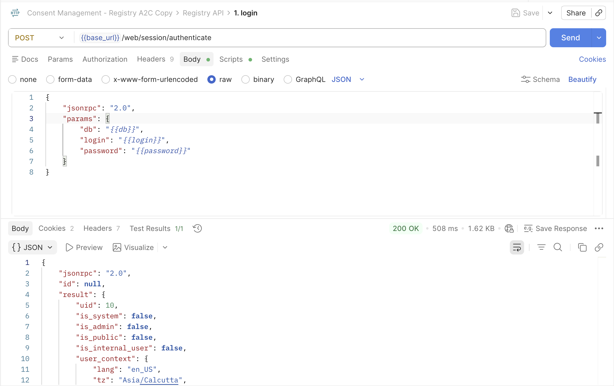

**POST** `/web/session/authenticate`

```json
{
  "jsonrpc": "2.0",
  "method": "call",
  "params": {
    "db": "{{db}}",
    "login": "{{login}}",
    "password": "{{password}}"
  }
}
```

#### Variables

| Variable | Source | Example (production) |
|----------|--------|----------------------|
| `{{db}}` | The Odoo database name to authenticate against | `socialregistrydb` |
| `{{login}}` | The consent partner account username/email | Contact administrator |
| `{{password}}` | The consent partner account password | Contact administrator |

Postman automatically handles session cookies if the **Send cookies** option is enabled (default behavior). Ensure you run the authentication request before invoking any other registry endpoint.

### Success Response

```json
{
  "jsonrpc": "2.0",
  "id": null,
  "result": {
    "uid": 10,
    "is_system": false,
    "is_admin": false,
    "is_public": false,
    "is_internal_user": false,
    "user_context": {
      "lang": "en_US",
      "tz": "Asia/Calcutta",
      "uid": 10
    },
    "db": "odoo",
    "user_settings": {
      "id": 6,
      "user_id": {
        "id": 10
      },
      "is_discuss_sidebar_category_channel_open": true,
      "is_discuss_sidebar_category_chat_open": true,
      "push_to_talk_key": false,
      "use_push_to_talk": false,
      "voice_active_duration": 200,
      "volume_settings_ids": [
        [
          "ADD",
          []
        ]
      ]
    },
    "server_version": "17.0-20260513",
    "server_version_info": [
      17,
      0,
      0,
      "final",
      0,
      ""
    ],
    "support_url": "https://www.odoo.com/buy",
    "name": "A2C Service Partner",
    "username": "a2c@test.com",
    "partner_display_name": "A2C Service Partner, A2C Service Partner",
    "partner_id": 50,
    "web.base.url": "http://registry.oanstaging.com",
    "active_ids_limit": 20000,
    "profile_session": null,
    "profile_collectors": null,
    "profile_params": null,
    "max_file_upload_size": 134217728,
    "home_action_id": false,
    "cache_hashes": {
      "translations": "7167fba95be71ce14a1aeaa1b292afa1c78adcfb"
    },
    "currencies": {
      "1": {
        "symbol": "$",
        "position": "before",
        "digits": [
          69,
          2
        ]
      }
    },
    "bundle_params": {
      "lang": "en_US"
    },
    "user_id": [
      10
    ],
    "websocket_worker_version": "17.0-3",
    "dialog_size": "minimize",
    "chatter_position": "side",
    "is_quick_edit_mode_enabled": false
  }
}
```

---

## Step 2: Search Farmer

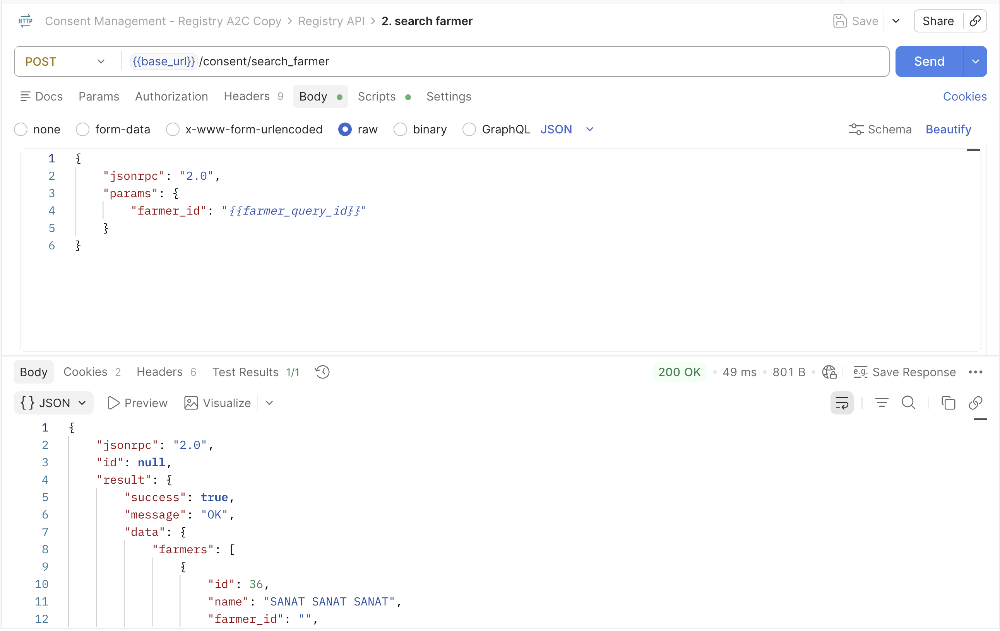

**POST** `/consent/search_farmer`

Query a farmer's record by land ID before initiating the consent workflow. Pass the land ID via `query` (same as the consent portal UI).

### Expected Request Body

```json
{
  "jsonrpc": "2.0",
  "params": {
    "query": "{{land_id}}"
  }
}
```

The portal sends the same shape with `method: "call"` and `id: 1`; those fields are optional for API clients.

#### Variables

| Variable | Source | Example |
|----------|--------|---------|
| `{{land_id}}` | Entered manually — the land parcel ID passed as `query` | `123456` |

### Success Response

```json
{
  "jsonrpc": "2.0",
  "id": null,
  "result": {
    "success": true,
    "message": "OK",
    "data": {
      "farmers": [
        {
          "id": 36,
          "name": "SANAT SANAT SANAT",
          "farmer_id": "",
          "phone": "",
          "reg_ids": [
            "123457",
            "123456"
          ],
          "profile_image_url": "",
          "otp_identifier": "123456",
          "otp_identifier_type": "FIN",
          "otp_identifier_source": "UID",
          "otp_available": true
        },
        {
          "id": 38,
          "name": "VIBHU VIBHU ",
          "farmer_id": "",
          "phone": "+917339281604",
          "reg_ids": [
            "9876543345678",
            "123456"
          ],
          "profile_image_url": "",
          "otp_identifier": "123456",
          "otp_identifier_type": "FIN",
          "otp_identifier_source": "UID",
          "otp_available": true
        }
      ]
    }
  }
}
```

#### User Interface

In the search field, enter the target farmer's land ID (e.g., `123456` or `1234567`), click **Search**, and then click **Select** on the matching record.

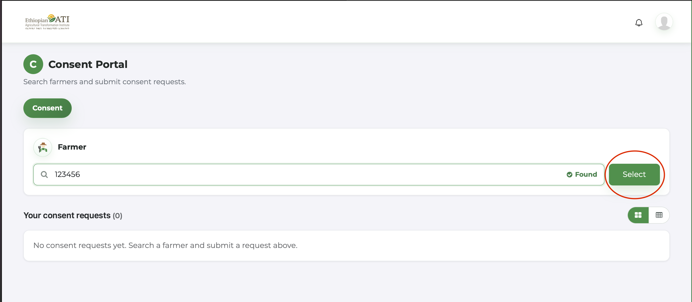

---

## Step 3: Request OTP

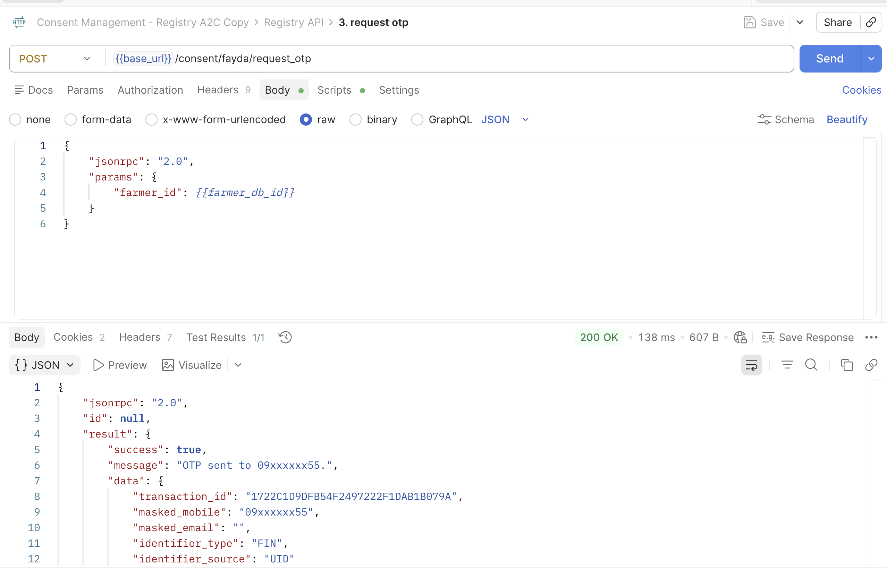

**POST** `/consent/fayda/request_otp`

### Expected Request Body

```json
{
  "jsonrpc": "2.0",
  "params": {
    "farmer_id": {{farmer_db_id}}
  }
}
```

#### Variables

| Variable | Source | Example |
|----------|--------|---------|
| `{{farmer_db_id}}` | The registry `res.partner` `id` of the farmer selected from the Step 2 response | `36` |

### Success Response

```json
{
  "jsonrpc": "2.0",
  "id": null,
  "result": {
    "success": true,
    "message": "OTP sent to 09xxxxxx55.",
    "data": {
      "transaction_id": "1722C1D9DFB54F2497222F1DAB1B079A",
      "masked_mobile": "09xxxxxx55",
      "masked_email": "",
      "identifier_type": "FIN",
      "identifier_source": "UID"
    }
  }
}
```

#### User Interface

Click the **Select** button to proceed to the **Verification** stage. Choose one of the two supported verification methods: **Fayda OTP** or **Face + Liveness**.

Select **Fayda OTP** to open the verification modal, and then click **Send Code** to trigger a 6-digit OTP code to the farmer's registered mobile number.


---

## Step 4: Verify OTP

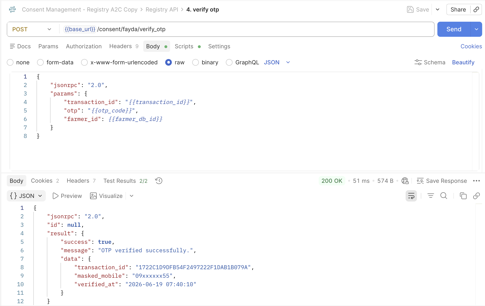

**POST** `/consent/fayda/verify_otp`

### Expected Request Body

```json
{
  "jsonrpc": "2.0",
  "params": {
    "transaction_id": "{{transaction_id}}",
    "otp": "{{otp_code}}",
    "farmer_id": {{farmer_db_id}}
  }
}
```

#### Variables

| Variable | Source | Example |
|----------|--------|---------|
| `{{transaction_id}}` | OTP transaction ID returned by the Step 3 response | `1722C1D9DFB54F2497222F1DAB1B079A` |
| `{{otp_code}}` | Entered manually — the 6-digit code received on the farmer's mobile | `123456` |
| `{{farmer_db_id}}` | The registry `res.partner` `id` of the farmer (from the Step 2 response) | `36` |

### Success Response

```json
{
  "jsonrpc": "2.0",
  "id": null,
  "result": {
    "success": true,
    "message": "OTP verified successfully.",
    "data": {
      "transaction_id": "1722C1D9DFB54F2497222F1DAB1B079A",
      "masked_mobile": "09xxxxxx55",
      "verified_at": "2026-06-19 07:40:10"
    }
  }
}
```

Once the OTP request is triggered, the modal displays a confirmation message alongside the farmer's masked mobile number (e.g., `09xxxxxx55`). The interface is now ready to receive the 6-digit verification code.


---

## Step 5: Fetch Consent Reasons

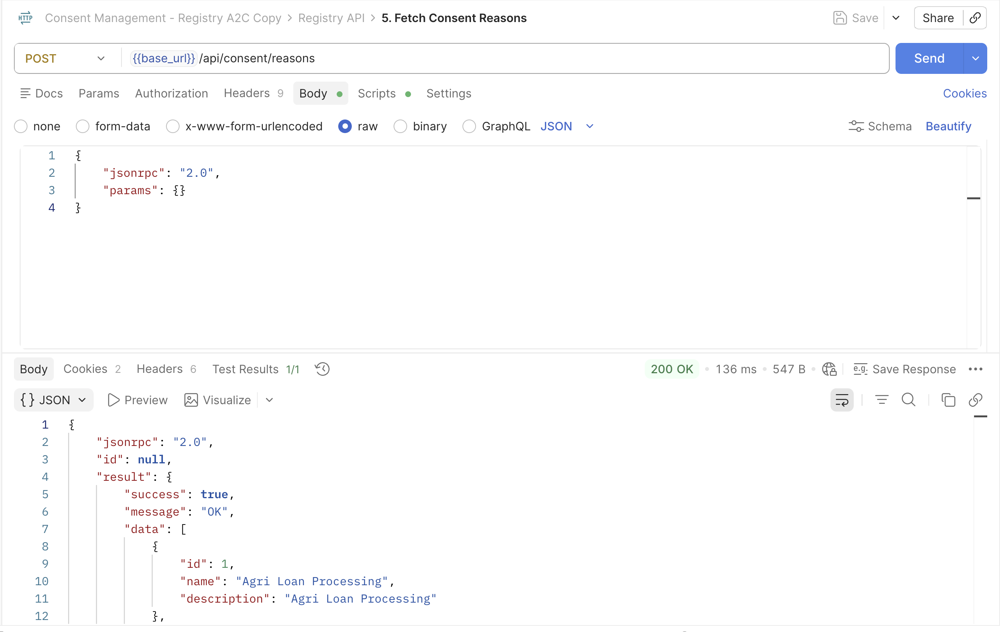

**GET** `/api/consent/reasons`

Retrieve the active consent reasons configured in the registry.

### Expected Request Body

```json
{
  "jsonrpc": "2.0",
  "params": {}
}
```

> On **staging**, this endpoint may be called as `POST` with `"method": "call"`.

### Success Response

```json
{
  "jsonrpc": "2.0",
  "id": null,
  "result": {
    "success": true,
    "message": "OK",
    "data": [
      {
        "id": 1,
        "name": "Agri Loan Processing",
        "description": "Agri Loan Processing"
      },
      {
        "id": 3,
        "name": "Crop Loan Processing",
        "description": "Crop Loan Processing "
      },
      {
        "id": 2,
        "name": "Machinary Loan Processing",
        "description": "Machinary Loan Processing "
      }
    ]
  }
}
```

#### User Interface

The frontend application queries this endpoint when rendering the **Consent Details** form to retrieve the list of active reasons. This list is used to populate the options in the **Consent Reason** dropdown.


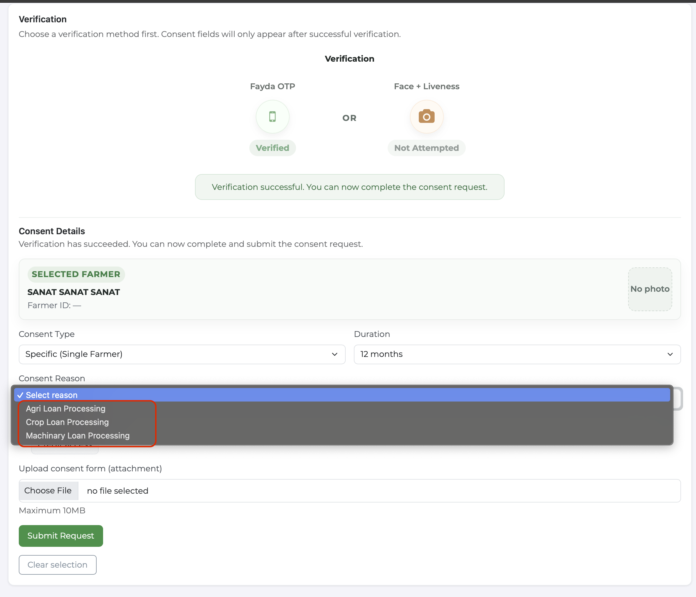


---

## Step 6: Fetch Allowed Data Fields

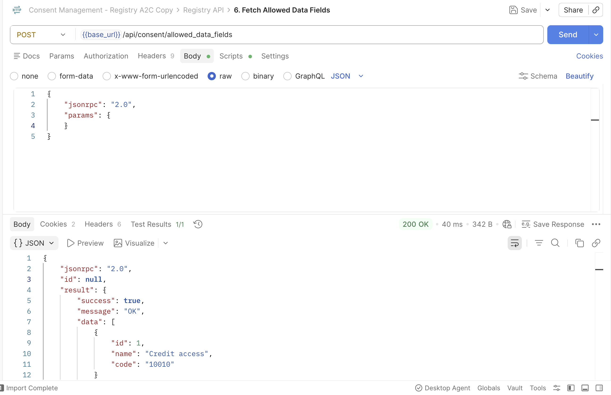

**GET** `/api/consent/allowed_data_fields`

Retrieve the list of data fields that this consent partner is authorized to request.

### Expected Request Body

```json
{
  "jsonrpc": "2.0",
  "params": {}
}
```

> On **staging**, this endpoint may be called as `POST` with `"method": "call"`.

### Success Response

```json
{
  "jsonrpc": "2.0",
  "id": null,
  "result": {
    "success": true,
    "message": "OK",
    "data": [
      {
        "id": 1,
        "name": "Credit access",
        "code": "10010"
      }
    ]
  }
}
```


#### User Interface

The frontend application queries this endpoint when rendering the **Consent Details** form to retrieve the permitted data fields for the partner. These fields are used to build the checkboxes under the **Requested Data Fields** section.

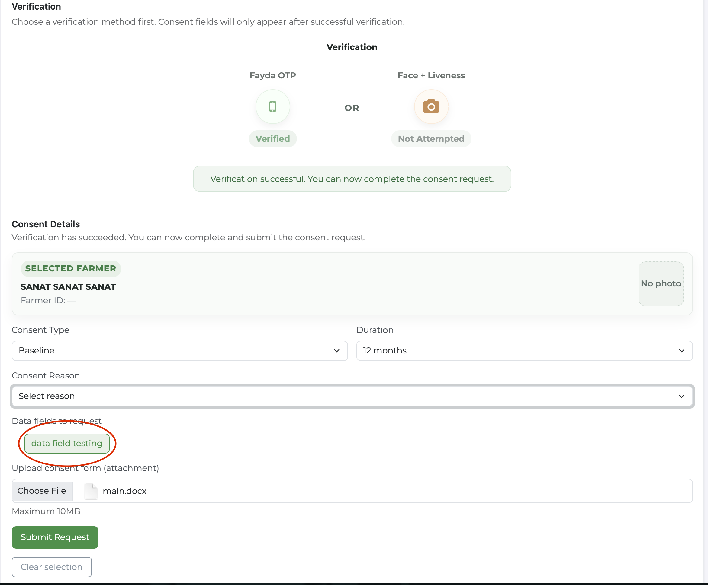


---

## Step 7: Submit Consent

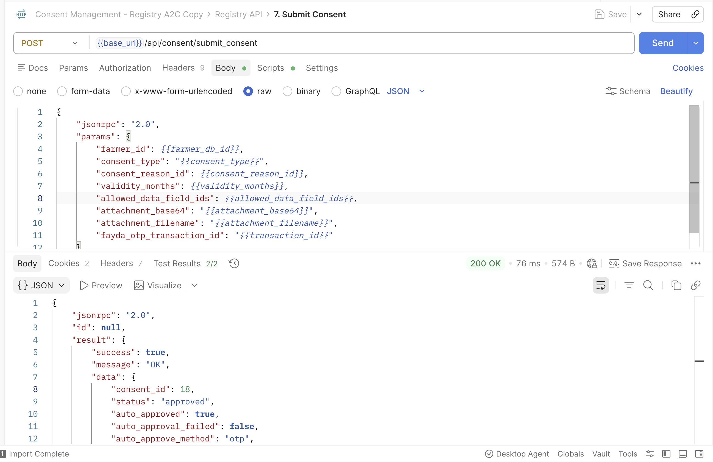

**POST** `/api/consent/submit_consent`

Submit the consent request with the validated OTP transaction ID and the signed consent document. Successful validation triggers immediate auto-approval and returns the farmer payload inline in `response_data`.

| Parameter | Required | Description |
|-----------|----------|-------------|
| `farmer_id` | Yes | Registry `res.partner` ID of the farmer |
| `consent_type` | No | Consent type. Defaults to `specific` |
| `consent_reason_id` | Yes | ID of the consent reason |
| `validity_months` | No | Validity duration in months. Defaults to `12` |
| `allowed_data_field_ids` | Yes | Array of authorized data field IDs (e.g. `[1]`) |
| `attachment_base64` | Yes | Base64-encoded PDF of the signed consent form |
| `attachment_filename` | Yes | Filename for the consent form attachment |
| `fayda_otp_transaction_id` | Yes | Transaction ID of the validated OTP |

### Expected Request Body

```json
{
  "jsonrpc": "2.0",
  "params": {
    "farmer_id": {{farmer_db_id}},
    "consent_type": "{{consent_type}}",
    "consent_reason_id": {{consent_reason_id}},
    "validity_months": {{validity_months}},
    "allowed_data_field_ids": {{allowed_data_field_ids}},
    "attachment_base64": "{{attachment_base64}}",
    "attachment_filename": "{{attachment_filename}}",
    "fayda_otp_transaction_id": "{{transaction_id}}"
  }
}
```

#### Variables

| Variable | Source | Example |
|----------|--------|---------|
| `{{farmer_db_id}}` | The registry `res.partner` `id` of the farmer (from the Step 2 response) | `36` |
| `{{consent_type}}` | Consent type. Defaults to `specific` | `specific` |
| `{{consent_reason_id}}` | A consent reason `id` from the Step 5 response | `3` |
| `{{validity_months}}` | Validity duration in months. Defaults to `12` | `12` |
| `{{allowed_data_field_ids}}` | Array of data field `id`s from the Step 6 response | `[1]` |
| `{{attachment_base64}}` | Base64-encoded PDF of the signed consent form | `JVBERi0xLjQ...` |
| `{{attachment_filename}}` | Filename for the consent form attachment | `consent_form.pdf` |
| `{{transaction_id}}` | OTP transaction ID returned by the Step 3 response | `1722C1D9DFB54F2497222F1DAB1B079A` |

### Success Response

On HTTP 200 / `result.success: true`, the response includes consent status and the full farmer data in `result.data.response_data`:

```json
{
  "jsonrpc": "2.0",
  "id": null,
  "result": {
    "success": true,
    "message": "OK",
    "data": {
      "consent_id": 9,
      "status": "approved",
      "auto_approved": true,
      "auto_approval_failed": false,
      "auto_approve_method": "otp",
      "error_details": null,
      "response_data": {
        "source": "g2p_ati_consent_mgt",
        "event_type": "WEBSUB_INDIVIDUAL_UPDATED",
        "published_at": "2026-06-20 13:27:07",
        "consent": {
          "id": 10,
          "consent_creation_request_id": "9cd96a35-f9b4-457c-98f9-d49080972380",
          "consent_type": "specific",
          "status": "approved",
          "approved_at": "2026-06-20 13:27:07",
          "validity_from": "2026-06-20 13:27:07",
          "validity_to": "2027-06-15 13:27:07",
          "requested_field_codes": [
            "NAME", "GENDER", "DOB-GC", "Email", "MARITIAL-STATUS",
            "NUM-CHILDREN", "HH-HEAD", "NUM_MALES", "NUM-FEMALES",
            "FAMILY-SIZE", "LAND", "REGION", "ZONE", "woreda", "KEBELE",
            "GEO-LON", "GEO-LAT"
          ],
          "published_field_codes": [
            "NAME", "GENDER", "DOB-GC", "Email", "MARITIAL-STATUS",
            "NUM-CHILDREN", "HH-HEAD", "NUM_MALES", "NUM-FEMALES",
            "FAMILY-SIZE", "LAND", "REGION", "ZONE", "woreda", "KEBELE",
            "GEO-LON", "GEO-LAT"
          ],
          "data_field_mode": "dynamic"
        },
        "consent_partner": {
          "id": 264515,
          "name": "COOP BANK",
          "ref": false,
          "websub_config_id": 4,
          "websub_config_name": "COOP"
        },
        "farmer": {
          "id": 612961,
          "farmer_id": "FR-9075201458",
          "name": "TEST TEST TEST"
        },
        "selected_data": {
          "NAME": { "name": "TEST TEST TEST" },
          "GENDER": { "gender": "male" },
          "DOB-GC": { "date_of_birth_gc": "1985-06-12" },
          "Email": { "email": false },
          "MARITIAL-STATUS": { "marital_status": "married" },
          "NUM-CHILDREN": { "number_of_children_in_the_family": 2 },
          "HH-HEAD": { "hh_head": "yes" },
          "NUM_MALES": { "number_of_males_in_family": 5 },
          "NUM-FEMALES": { "number_of_females_in_family": 4 },
          "FAMILY-SIZE": { "family_size": 0 },
          "LAND": [
            {
              "land_informations": {
                "id": 1333913,
                "name": "TEST TEST TEST"
              }
            }
          ],
          "REGION": {
            "region": { "id": 24, "name": "Oromiya", "code": "ET04" }
          },
          "ZONE": {
            "zone": { "id": 70, "name": "Mirab Shewa", "code": "ET0405" }
          },
          "woreda": {
            "woreda": { "id": 688, "name": "Cheliya", "code": "ET040505" }
          },
          "KEBELE": {
            "kebele": { "id": 10835, "name": "Bilof Keku", "code": "40505888003" }
          },
          "GEO-LON": { "geo_longitude": 0.0 },
          "GEO-LAT": { "geo_latitude": 0.0 }
        }
      }
    }
  }
}
```

| Field | Meaning |
|-------|---------|
| `data.consent_id` | Approved consent record ID |
| `data.response_data` | Full farmer payload — use this directly; no Kafka subscription required |
| `data.response_data.selected_data` | Published values keyed by field code (e.g. `NAME`, `GENDER`, `REGION`) |

#### User Interface

Once verification completes, the **Consent Details** section becomes active. Select the appropriate value from each dropdown.

Provide the following details:
1. **Consent Type** (either `Specific` or `Baseline`).
2. **Duration** (e.g., `12 months`).
3. **Consent Reason** (e.g., `Crop Loan Processing`).
4. **Requested Data Fields** (select the checkboxes for the relevant fields).
5. **Signed Consent Form Attachment** (upload the signed document in PDF format).

Once all fields are filled, click the **Submit Request** button to submit the application.


---

## Step 8: Farmer Data (staging only)

On **production**, farmer data is returned in **Step 7** inside `result.data.response_data`. No further API call is required.

On **staging**, farmer data may also appear asynchronously in the public S3 **`respone/`** folder. Use the Postman **Webhook Helpers** (`C. list farmer webhooks` / `D. fetch latest farmer webhook`) or see [`consent_management_postman_registry_a2c.md`](consent_management_postman_registry_a2c.md).

### Sample `response_data` structure

The `response_data` object (returned inline on production submit consent) has this shape:

```json
{
	"source": "g2p_ati_consent_mgt",
	"event_type": "WEBSUB_INDIVIDUAL_UPDATED",
	"published_at": "2026-06-19 12:51:04",
	"consent": {
		"id": 7,
		"consent_creation_request_id": "5212714a-300e-423c-aace-b1a841f9b4be",
		"consent_type": "specific",
		"status": "approved",
		"approved_at": "2026-06-19 12:51:04",
		"validity_from": "2026-06-19 12:51:04",
		"validity_to": "2027-06-14 12:51:04",
		"requested_field_codes": [
			"ati_fast_farmer_payload"
		],
		"published_field_codes": [
			"ati_fast_farmer_payload"
		],
		"data_field_mode": "dynamic"
	},
	"consent_partner": {
		"id": 264515,
		"name": "COOP BANK",
		"ref": false,
		"websub_config_id": 4,
		"websub_config_name": "COOP"
	},
	"farmer": {
		"id": 612961,
		"farmer_id": "FR-9075201458",
		"name": "TEST TEST TEST"
	},
	"selected_data": {
		"farmer": {
			"first_name_english": "Test",
			"fathers_name_english": "Test",
			"grandfathers_name_english": "Test",
			"first_name_amharic": "ሙከራ",
			"fathers_name_amharic": "ሙከራ",
			"grandfathers_name_amharic": "ሙከራ",
			"gender": "male",
			"birthdate": "1985-06-12",
			"active": true,
			"region": "Oromiya",
			"region_code": "ET04",
			"zone": "Mirab Shewa",
			"zone_code": "ET0405",
			"woreda": "Cheliya",
			"woreda_code": "ET040505",
			"kebele": "Bilof Keku",
			"kebele_code": "40505888003",
			"farmer_id": "FR-9075201458",
			"national_id": [
				"931795149087"
			],
			"marital_status": "married",
			"educational_level": "read_write",
			"house_hold_income": [
				"Livestock Production",
				"Others"
			],
			"other_farmer_in_household_with_separate_land": false,
			"total_owned_land": 0.65,
			"total_rented_land": 0.0,
			"total_land_area": 0.65,
			"total_crop_sharing_land": 0.0,
			"farming_type": "crop_farming",
			"primary_language": "Amharic",
			"phone_numbers": [
				{
					"id": 340728,
					"name": "+251989653278"
				}
			],
			"land_information": [
				{
					"id": 1333913,
					"name": "TEST TEST TEST"
				}
			]
		}
	}
}
```

| Field | Meaning |
|-------|---------|
| `consent` | Metadata of the approved consent record |
| `consent_partner` | Information about the partner receiving the data |
| `farmer` | Associated farmer registry record details |
| `selected_data` | Published field values based on the WebSub configuration |

#### User Interface

Upon submission, a success banner will confirm that the request has been submitted and automatically approved. Click **View Details** on the request card in the **Your consent requests** list.

The details modal will display the request's status, validity period, Fayda OTP verification timestamp, purpose, and associated attachments. Click **Back to requests** to close the modal.

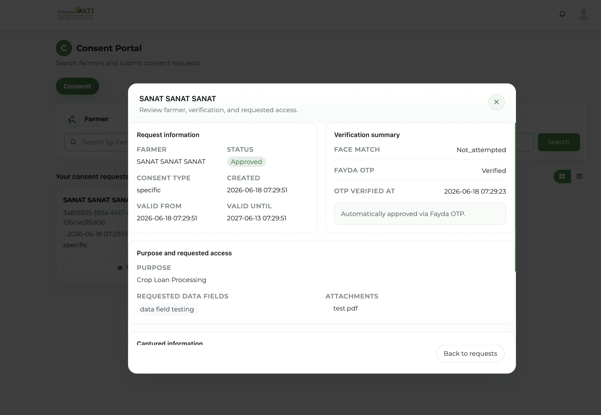
